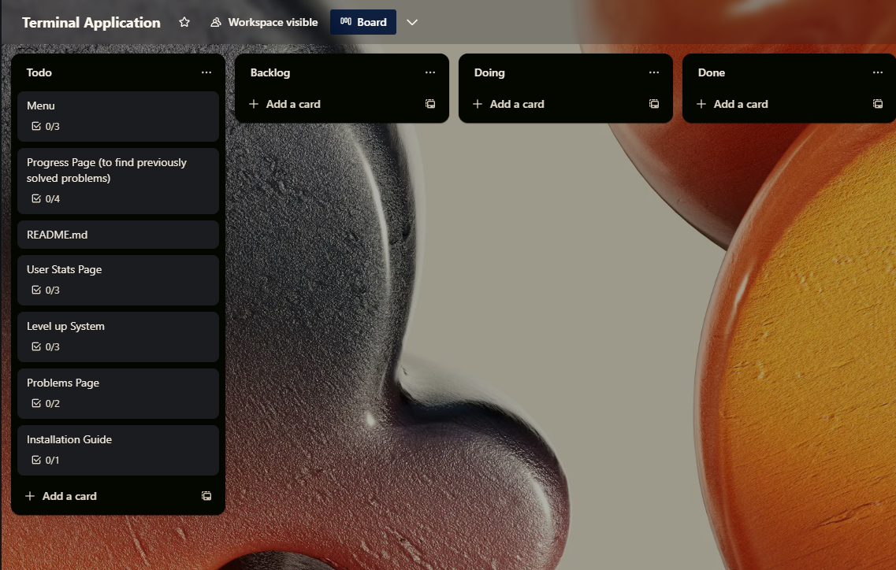
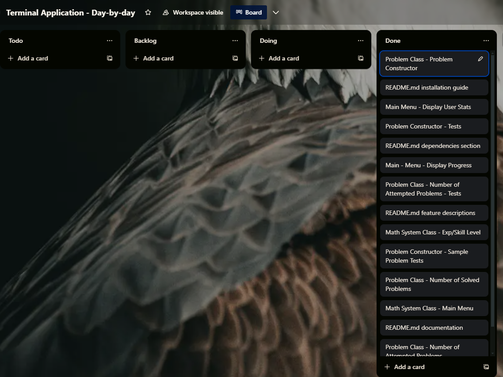
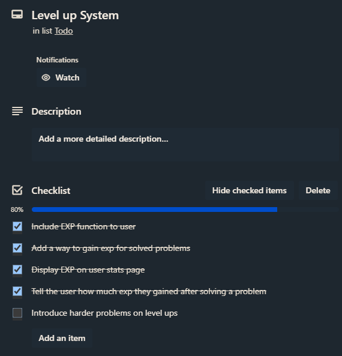
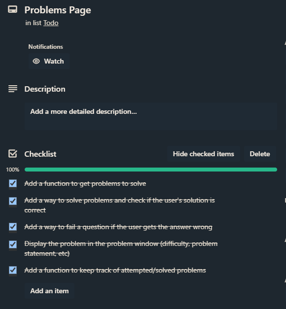
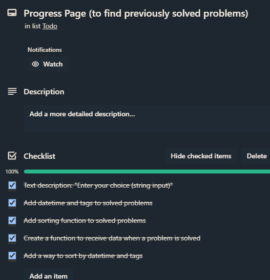
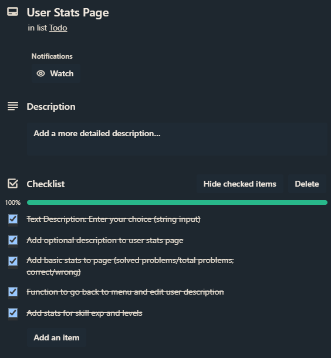

# MathSolverX-Terminal-Application

## Github Repo

[Github Project Link](https://github.com/duskpeyl/MathSolverX-Terminal-Application)

## Description 

This terminal application is a math learning system designed for students who want to improve their problem solving skills using problem sets from various math competitions such as MOEMS, AMC and MATHCOUNTS. As a fervent problem solver myself, I often find it difficult to organize problems for revision in an easy and comprehensive way due to the the lack of organization.

The purpose of this terminal application is to simultaneously provide a place for users to solve math problems, find previously solved problems (be able to sort through them, whether that be in a datetime format or topic), and provide basic statistics about a user's particular weakness on a math subject.

### Features 

#### Feature 1: Problem-Solving Window - Solve problems 

This feature is the main component that enables the user to read and receive problems. Problems sourced from math competitions are randomly selected depending on your initial skill level, and solving them through terminal input gives you EXP that go toward your skill exp bar. Upon a milestone in skill EXP, you level up and increase your chances of getting more difficult math problems.

#### Feature 2: Progress Window - Find previously solved problems 

The progress window is a simple feature that tracks the problems that you have previously solved. You can sort through these problems in the window by the problem's datetime (earliest solved/oldest solved), or by choosing the specific math topic of the problems.

#### Feature 3: User Stats Window - Find statistics about your math solving ability 

The user stats window is a feature that gives you statistics about your mathematical abilities in the form of percentages (solved/total). The user stats windows doubles as the user's profile, coming with a customizable description that can be edited using terminal input.

## Code Style 

The code for this project was styled according to [the PEP 8 Style Guide by Guido van Rossum, Barry Warsaw, and Alyssa Coghlan.](https://peps.python.org/pep-0008/)

## Implementation Plan 

  
Implementation Plan Details

#### Overall Plan 

  
Overall Plan

  

## Day-by-Day 

  
Day-by-Day Breakdown

#### 11/05/2024

#### 12/05/2024

#### 13/05/2024

## Checklists

  
TODO Checklists

### Dependencies 

* exceptiongroup==1.2.1
* iniconfig==2.0.0
* packaging==24.0
* pluggy==1.5.0
* pytest==8.2.0
* tomli==2.0.1

### Imported Packages/Modules 

* datetime
* random
* pytest

## Installation Guide 

### Step 1: Download the Project from Github

To run this terminal application, simply navigate to the green code button on the Github repository and press 'Download ZIP'.

### Step 2: Unzip the Project

After installing the project in the form of a zip file, unzip the project and change the permissions of the bash script from the file within the command line, with the following commands:

> cd ~/Downloads/Terminal-Application-Mathcounts-AMC-Solver-main

> chmod +x run_terminal_application.sh

This will allow your computer to execute the file.

### Step 3: Run the Program

Once you have changed the permissions of the bash script within the root directory of the unzipped project, run the following command:

> bash run_terminal_application.sh

This will download all of the dependencies needed for the program to run, then start the program itself.

## References 

* Python Software Foundation (2024). Datetime — Basic Date and Time Types — Python 3.12.3 Documentation. [online] Python.org. Available at: [Link to datetime library](https://docs.python.org/3/library/datetime.html).
* GNU (2022). Bash Reference Manual. [online] Available at: [Link to Bash Manual](https://www.gnu.org/software/bash/manual/bash.html).
* Van Rossum, G., Warsaw, B. and Coghlan, N. (2023). PEP 8 – Style Guide for Python Code | peps.python.org. [online] peps.python.org. Available at: [Link to PEP Guide](https://peps.python.org/pep-0008/).
* Pytest (2024). Full pytest documentation — pytest documentation. [online] Available at: [Link to PyTest Documentation](https://docs.pytest.org/en/8.2.x/contents.html).
* Python Software Foundation (2024). Random — Generate pseudo-random numbers — Python 3.12.3 Documentation. [online] Python.org. Available at: [Link to Random library](https://docs.python.org/3/library/random.html).
